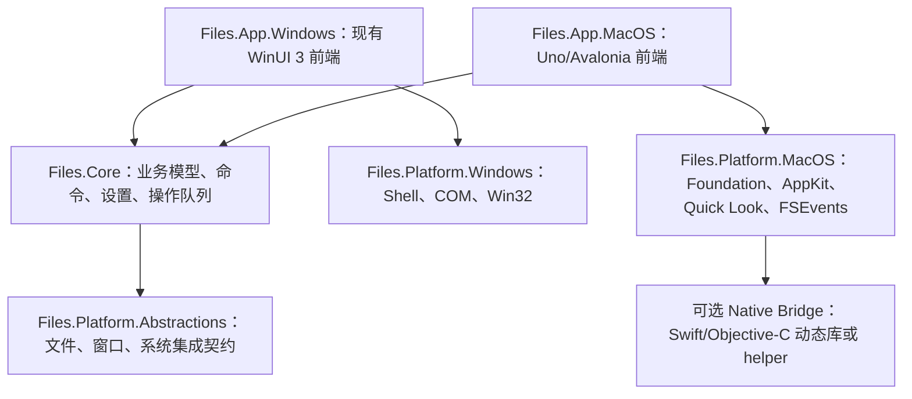

# Files macOS 移植规划

> 状态：初步可行性分析  
> 更新日期：2026-07-14  
> 适用范围：在保留现有 Windows 版本的前提下，为 Files 增加 macOS 桌面版本。

## 1. 结论摘要

将 Files 移植到 macOS **技术上可行**，但不能通过给现有 `Files.App` 增加一个 macOS 目标框架直接完成。当前应用的 UI、文件操作、Shell 集成、后台任务和部分数据模型均与 WinUI 3、Windows App SDK、WinRT、COM 和 Win32 紧密耦合，因此应把项目视为一次“跨平台架构改造 + macOS 平台实现”，而不是简单重新编译。

建议采用以下总体路线：

1. 保留 `Files.App` 作为 Windows WinUI 3 前端，避免为了 macOS 回归而一次性重写稳定的 Windows 版本。
2. 把可复用的业务逻辑、命令、设置模型和文件系统契约下沉到无 UI、无平台依赖的 .NET 项目。
3. 新建 macOS 前端和 macOS 平台服务，通过统一接口分别接入 Windows 与 macOS 实现。
4. 第一阶段使用 **Uno Platform + Skia Desktop** 做移植验证，因为 Uno 使用 WinUI XAML/API 形状，理论上能最大化复用现有页面、资源和 MVVM 代码；同时保留 **Avalonia** 作为验证失败时的长期替代方案。
5. macOS 原生能力通过小型 Swift/Objective-C 桥接层或经过验证的 .NET macOS 绑定接入，不在跨平台核心中散布 AppKit/POSIX 调用。
6. MVP 优先采用 Developer ID 签名、公证后的站外分发。Mac App Store 要求 App Sandbox，会显著改变文件访问模型，应在独立里程碑中验证。

可行性评级：

| 维度 | 评级 | 说明 |
| --- | --- | --- |
| 核心业务复用 | 中 | `Files.Shared`、`Files.Core.Storage` 和部分服务/ViewModel 可复用，但仍需清理 Windows 类型渗透 |
| UI 复用 | 中低 | Uno 有机会复用部分 WinUI XAML；第三方 WinUI 控件、自定义控件和窗口行为必须逐项验证 |
| 文件系统功能 | 中 | 基础 I/O 可用 .NET；回收站、缩略图、文件监控、权限和 iCloud/File Provider 需要 macOS 实现 |
| 系统集成 | 低 | Windows Shell、COM、注册表、跳转列表、任务栏和 WSL 等能力不能直接复用 |
| 发布运维 | 中 | 必须增加 macOS 构建机、代码签名、Hardened Runtime、公证和双架构产物 |
| 总体结论 | 可行，工作量较大 | 适合渐进式双前端架构，不适合一次性替换现有 Windows UI |

## 2. 当前代码库评估

### 2.1 现状

仓库当前使用 .NET 10 和 C# preview，主要项目与平台关系如下：

| 项目 | 当前定位 | macOS 复用判断 |
| --- | --- | --- |
| `Files.Shared` | 通用扩展、日志、序列化和辅助类型 | 高，但需移除项目中的仅 Windows RID 配置并验证各 API |
| `Files.Core.Storage` | 存储契约，依赖 `OwlCore.Storage` | 中高，是扩展 macOS 存储实现的主要基础 |
| `Files.App.Storage` | FTP、旧存储模型及大量 Windows Shell 存储实现 | 低到中；FTP 可复用，`Windows` 目录必须由 macOS 实现替代 |
| `Files.App.Controls` | WinUI 3 自定义控件和样式 | 低到中；只能在 Uno 验证通过的部分复用 |
| `Files.App` | WinUI 页面、ViewModel、命令、服务和应用生命周期 | ViewModel/业务代码部分可复用，UI 与生命周期需要平台拆分 |
| `Files.App.CsWin32` | CsWin32 生成的 Win32/COM 互操作 | macOS 不复用，仅保留 Windows 目标 |
| `Files.App.Server` | Windows App Service/WinRT 服务 | macOS 不复用，需要进程内服务或 macOS helper 替代 |
| `Files.App.BackgroundTasks` | Windows 后台任务 | macOS 不复用，按需求改为进程内任务或平台机制 |

本次静态盘点中，主要 C#/XAML 规模约为：

- `Files.App`：989 个文件，约 12.98 万行。
- `Files.App.Controls`：144 个文件，约 2.19 万行。
- `Files.App.Storage`：38 个文件，约 0.32 万行。
- `Files.Core.Storage` 与 `Files.Shared`：合计约 0.18 万行。

这些数字只用于判断改造规模，不等于实际重写行数。真正的复用率必须由第一个技术验证阶段测量。

### 2.2 主要平台耦合

当前明显的阻塞点包括：

- `Files.App` 和 `Files.App.Controls` 使用 WinUI 3、Windows App SDK、WinUI Community Toolkit、Win2D 和 WinUIEx。
- `Files.App.Storage` 直接引用 `Files.App.CsWin32`，文件枚举、属性、缩略图、上下文菜单和批量操作使用 Windows Shell/COM。
- 应用启动和依赖注入直接注册 `WindowsRecentItemsService`、`WindowsSecurityService`、`WindowsDialogService`、`WindowsQuickAccessService` 等 Windows 服务。
- 数据模型和 ViewModel 中仍出现 `IWindowsStorable`、`WindowsStorable` 等具体平台类型，说明当前抽象边界不完整。
- 现有项目普遍只声明 `win-x86`、`win-x64`、`win-arm64` RID。
- 属性页中的安全、兼容性、快捷方式、签名、库等页面大量依赖 NTFS、PE、`.lnk` 或 Windows Shell 概念，macOS 只能提供等价能力或隐藏不适用功能。

### 2.3 可直接或经小幅调整复用的内容

- CommunityToolkit.Mvvm 的 ObservableObject、命令和消息模式。
- 纯 C# 的排序、过滤、路径展示、校验、哈希、日志和序列化逻辑。
- FTP、Git、SQLite、压缩、媒体元数据等功能中经 NuGet/RID 审计确认支持 macOS 的部分。
- 文件管理器的产品模型：标签页、双窗格、历史记录、侧边栏、状态中心、批量重命名和操作队列。
- 资源字符串和图标语义；XAML 资源文件能否原样复用取决于最终 UI 框架。

## 3. 推荐目标架构

建议逐步形成以下项目边界，名称可在实施时按仓库规范调整：

- `Files.Core`：从 `Files.App` 提取与 UI 无关的业务逻辑和状态模型，目标为 `net10.0`。
- `Files.Platform.Abstractions`：定义文件项目、文件操作、系统对话框、缩略图、预览、剪贴板、文件监控、磁盘、回收站和应用启动等契约。
- `Files.Platform.Windows`：承接现有 CsWin32、Windows Shell、WinRT 和 Windows 专用服务。
- `Files.Platform.MacOS`：实现 macOS 文件系统和桌面集成。
- `Files.App.Windows`：继续使用 WinUI 3；迁移过程中可以暂时保留当前项目名。
- `Files.App.MacOS`：macOS UI 入口、菜单、窗口生命周期、快捷键和平台资源。

平台边界应遵循两个原则：

1. ViewModel 只依赖抽象和跨平台模型，不出现 `Windows.*`、`Microsoft.UI.*`、`AppKit.*` 或原生句柄。
2. 平台差异由能力查询表达，例如 `IPlatformCapabilities.SupportsFileTags`，不要在业务代码中大量使用运行时操作系统判断。

## 4. UI 技术路线比较

### 4.1 推荐验证路线：Uno Platform

Uno Platform 的官方文档说明其 API 与 WinUI 3 兼容，并能把 WinUI XAML/C# 应用运行到 macOS；macOS Desktop 使用标准 .NET 桌面目标和 Skia 渲染。对本仓库而言，它最大的价值是降低页面、样式、依赖属性和自定义控件的首轮迁移成本。[Uno Platform 概览](https://platform.uno/docs/articles/what-is-uno.html) [Uno 工作原理](https://platform.uno/docs/articles/how-uno-works.html) [支持的平台](https://platform.uno/docs/articles/getting-started/requirements.html)

优点：

- 与现有 WinUI XAML、`Microsoft.UI.Xaml` API 和 MVVM 结构最接近。
- 可以保留 Windows 端使用原生 WinUI 3，同时为 macOS 增加 Desktop head。
- 支持条件 XAML/条件代码，便于逐步替换平台行为。

风险：

- Uno 并未实现全部 WinUI/WinRT API，未实现部分会由分析器提示，必须实测。
- WinUI Community Toolkit、Labs 控件、Win2D、WinUIEx 和自定义控件不能假设可直接运行。
- Skia 桌面 UI 需要专门适配 macOS 菜单、键盘、拖放、触控板、窗口材质和可访问性，不能只追求 Windows 像素级外观。
- 当前仓库使用 .NET 10 与 preview 语言特性，应在 spike 中确认 Uno SDK、源生成器和所有关键包的版本组合。

Go/No-Go 标准见第 8 节。只有技术验证达标后，Uno 才正式成为实现方案。

### 4.2 备选路线：Avalonia

Avalonia 官方支持 Windows、macOS 和 Linux，当前 macOS 具有明确的支持层级，并使用自己的 Objective-C++ 后端。[Avalonia 支持的平台](https://docs.avaloniaui.net/docs/supported-platforms)

优点：

- 成熟的跨平台桌面定位和 macOS 支持。
- 对未来 Linux 版本更有利。
- 可继续使用 C#、XAML 和 MVVM，业务层迁移成果可以保留。

缺点：

- Avalonia XAML 和控件体系不是 WinUI 3，现有页面、样式、自定义控件和 WinUI Toolkit 用法需要较大幅度重写。
- Windows 端若也迁移到 Avalonia，会扩大范围并引入现有功能回归；若只用于 macOS，则长期维护两套 UI。

建议：若 Uno spike 中核心控件/布局复用率低于 50%，或者关键列表性能、输入、无障碍能力无法达标，则转为 Avalonia，并接受 macOS 前端重写。

### 4.3 不推荐作为本项目首选：.NET MAUI

.NET MAUI 的 macOS 目标实际基于 Mac Catalyst，而不是完整 AppKit 桌面应用模型。[.NET MAUI 支持的平台](https://learn.microsoft.com/dotnet/maui/supported-platforms?view=net-maui-10.0) 对普通跨端业务应用很合适，但 Files 需要深度文件系统、窗口、菜单、Finder 和桌面交互，Catalyst 会增加平台能力绕行成本，同时也无法复用 WinUI XAML，因此不建议作为首选。

### 4.4 原生 Swift/AppKit

原生 AppKit/SwiftUI 能获得最佳 macOS 体验和最完整的系统 API，但 UI 几乎全部重写，且团队需要长期维护 C# 与 Swift 两套业务实现或设计复杂桥接。建议只把 Swift/Objective-C 用作小型平台桥接层，而不是第一版的完整 UI 技术栈。

## 5. 建议技术栈

| 层 | 建议技术 | 用途 |
| --- | --- | --- |
| 运行时 | .NET 10、C# | 复用现有语言、DI、异步和业务模型 |
| UI 首选 | Uno Platform + Skia Desktop | 最大化验证 WinUI XAML 与控件代码复用 |
| UI 备选 | Avalonia | Uno 兼容性或性能不达标时使用 |
| MVVM | CommunityToolkit.Mvvm | Observable、命令和消息机制 |
| 依赖注入/日志 | Microsoft.Extensions.DependencyInjection、Logging | 延续现有模式，按平台组合服务 |
| 基础文件 I/O | `System.IO`、`FileSystemWatcher`（基础路径） | 通用文件枚举、流和简单监控 |
| macOS 文件协调 | Foundation `NSFileCoordinator` / `NSFilePresenter` | iCloud、File Provider 和跨进程文件操作协调；避免 UI 线程阻塞。[Apple 文档](https://developer.apple.com/documentation/foundation/nsfilecoordinator) |
| 文件系统事件 | FSEvents，必要时配合目录级 watcher | 大目录、卷级变更监控。[Apple 文档](https://developer.apple.com/documentation/coreservices/1443980-fseventstreamcreate) |
| 打开/复制/回收站/Finder 定位 | AppKit `NSWorkspace` | 使用与 Finder 一致的回收站、复制和打开行为。[Apple 文档](https://developer.apple.com/documentation/appkit/nsworkspace) |
| 缩略图/预览 | QuickLookThumbnailing、Quick Look | 系统缩略图与预览；`QLThumbnailGenerator` 支持图片、文本、PDF、音视频等常见格式。[Apple 文档](https://developer.apple.com/documentation/quicklookthumbnailing/creating-quick-look-thumbnails-to-preview-files-in-your-app) |
| 文件类型 | Uniform Type Identifiers | 替代 Windows 扩展名/ProgID/Shell 类型判断。[Apple 文档](https://developer.apple.com/documentation/uniformtypeidentifiers/) |
| 权限与持久访问 | App Sandbox entitlements、security-scoped bookmarks | 沙盒版本持久访问用户选择的目录。[Apple 文档](https://developer.apple.com/documentation/security/accessing-files-from-the-macos-app-sandbox) |
| 原生桥接 | 优先使用受支持的 .NET binding；不足时用 Swift/Objective-C 导出稳定 C ABI，通过 source-generated interop 调用 | 隔离 AppKit、Foundation、CoreServices 与 C# 的边界 |
| 本地数据 | SQLite、JSON 设置 | 沿用现有能力，迁移到 `~/Library/Application Support/<bundle-id>` 等标准目录 |
| 发布 | `osx-arm64`、`osx-x64`，`.app`/DMG，codesign、Hardened Runtime、`notarytool`、stapler | Apple Silicon/Intel 构建、签名和公证。[Apple 公证文档](https://developer.apple.com/documentation/security/notarizing-macos-software-before-distribution) |
| CI | macOS 构建机 + GitHub Actions 或现有 CI | 构建、测试、签名、公证和产物验证 |

## 6. macOS 功能映射

| Windows 能力 | macOS 实现建议 | MVP |
| --- | --- | --- |
| Explorer/Shell 文件枚举 | `System.IO` + Foundation URL resource values | 是 |
| `IFileOperation` 复制/移动/删除 | 自有异步操作队列；关键路径使用 `NSFileCoordinator`；删除使用 `NSWorkspace.recycle` | 是 |
| Shell 缩略图/图标 | `QLThumbnailGenerator` + `NSWorkspace` 文件图标 | 是 |
| Shell 预览处理器 | Quick Look；应用内文本/图片/PDF 预览作为回退 | 是 |
| Shell 上下文菜单 | 应用自有菜单 + `NSWorkspace` 打开方式；不尝试复刻 Finder 扩展菜单 | 是 |
| 快速访问/固定目录 | 应用自己的收藏 + security-scoped bookmark | 是 |
| Windows 回收站 | `NSWorkspace.recycle`，处理各卷 Trash 语义 | 是 |
| 驱动器/可移动设备 | `NSWorkspace` 卷通知，必要时使用 Disk Arbitration | 是 |
| 文件监控 | `FileSystemWatcher` 起步，压力测试后切换/补充 FSEvents | 是 |
| 剪贴板/拖放 | `NSPasteboard`、file URL、UTType；由 UI 框架适配常规拖放 | 是 |
| NTFS ACL/安全属性 | 已实现 POSIX mode、owner/UID、group/GID、ACL 文本及隐藏/锁定标记的原生读写与事务回滚；修改身份仍遵循 macOS 权限限制 | 已实现等价能力 |
| Windows 文件标签 | 已实现 Finder tags 原生读写、搜索与属性页编辑；App Store 合规性仍需发布前验证 | 部分实现 |
| `.lnk` 快捷方式 | 已以相对 symbolic link 实现“创建快捷方式”等价能力；macOS alias 文件仍可作为后续增强 | 已实现 |
| WSL、注册表、开始菜单、跳转列表 | macOS 无等价能力，隐藏或替换为终端、Dock/Recent Documents 等行为 | 不移植/替代 |
| PowerShell/Windows Terminal | 使用用户配置的 Terminal、iTerm2、Warp 等启动适配 | 是 |
| Store 更新 | 直发版本使用 Sparkle 或自有更新服务；App Store 版本使用 Store 更新 | 后续 |

## 7. 分发模型是关键架构决策

### 7.1 Developer ID 站外分发（建议 MVP）

优点是文件管理器可以在用户权限范围内访问更多路径，避免每个根目录都依赖安全作用域书签。发布需要 Developer ID 签名、Hardened Runtime、公证和票据 stapling。Apple 建议所有 App Store 外分发的软件都进行公证。

仍需正确处理以下限制：

- TCC 隐私权限、Full Disk Access、POSIX 权限、ACL 和 SIP。
- 不应尝试绕过系统保护；遇到不可访问目录时必须提供明确错误和授权引导。
- helper、原生动态库和所有可执行文件都必须在最终打包顺序中正确签名。

### 7.2 Mac App Store 分发

Mac App Store 要求 App Sandbox。沙盒应用不能无限制访问用户主目录；用户通过系统选择器授权的目录需要保存 security-scoped bookmark，并在每次使用时平衡 `startAccessingSecurityScopedResource`/`stopAccessingSecurityScopedResource`。Apple 也明确列出了沙盒中被禁止或受限的系统行为。[App Sandbox](https://developer.apple.com/documentation/security/protecting-user-data-with-app-sandbox)

因此建议：

- 先把“直发版”和“沙盒版”设计为两套 entitlement/profile，而不是后期给同一个包临时加沙盒。
- 在架构层引入 `IAccessGrantStore`，把安全作用域书签当成一级数据模型。
- 在 MVP 完成前做一次 App Store 能力审计，再决定是否发布功能受限的 Store 版本。

## 8. 分阶段实施计划

### 阶段 0：架构决策与技术验证（2～4 周）

目标是用真实代码降低最大的不确定性，不追求完整功能。

任务：

1. 建立 Uno macOS Desktop spike，不改动现有 Windows 发布链。
2. 移植 `MainWindow` 的骨架、侧边栏、标签栏、地址栏和一种文件列表布局。
3. 验证主题资源、依赖属性、数据绑定、虚拟化、右键菜单、拖放、快捷键和多窗口。
4. 对 WinUI Toolkit、Labs、Win2D、WinUIEx 和所有直接 UI 包输出兼容性清单。
5. 构建一个最小 macOS native bridge，验证目录选择、缩略图、回收站和 Finder 定位。
6. 在 Apple Silicon 和 Intel/x64（真实设备或受支持的 CI runner）上测量启动、滚动和大目录性能。

Uno Go 标准：

- 核心壳层 XAML/控件代码复用率不低于 50%。
- 10,000 项目录列表能够虚拟化，不因缩略图加载持续阻塞 UI。
- 键盘、鼠标、右键、拖放、缩放和 VoiceOver 的基础链路可工作。
- 原生桥接可稳定返回错误、支持取消，并且没有跨线程 UI 调用问题。
- `osx-arm64`、`osx-x64` 均可构建和启动。

如未达标，终止 Uno 路线，使用已经抽出的核心/平台契约转入 Avalonia spike。

交付物：技术选型 ADR、兼容性矩阵、性能基线、可运行原型和更新后的工作量估算。

### 阶段 1：抽离跨平台核心（4～8 周）

1. 新建平台契约项目，明确文件项目、操作队列、预览、缩略图、监控、磁盘和系统集成接口。
2. 从 ViewModel/模型移除 `IWindowsStorable`、`Windows.Storage`、WinUI 类型和静态 IoC 获取。
3. 将依赖注入拆为 Core、Windows、macOS 三组注册扩展。
4. 使 `Files.Shared`、`Files.Core.Storage` 和新核心项目可在 `osx-arm64`/`osx-x64` 目标下还原和编译。
5. 为路径大小写、Unicode 规范化、符号链接、文件 package 和 Unix 权限补充单元测试。

完成标准：同一组核心程序集可被 Windows 和最小 macOS host 引用，核心项目不再引用任何 UI 或操作系统专用包。

### 阶段 2：macOS MVP（8～16 周）

MVP 范围：

- 单/多标签页浏览、地址导航、前进/后退/向上。
- 列表/网格至少各一种布局，排序、过滤和基础搜索。
- 新建、复制、移动、重命名、回收站、永久删除及冲突处理。
- 拖放、复制/剪切/粘贴、Undo/Redo（先限定应用内操作）。
- 本地卷、外置卷、基础网络路径和 FTP 中已验证的部分。
- Quick Look 缩略图/预览、打开方式和 Finder 定位。
- 收藏、最近位置、设置、主题、日志和崩溃上报。
- Apple Silicon 与 Intel 发布包、签名和公证。

明确不进入 MVP：Windows 专用属性页、WSL、注册表、开始菜单、Windows 文件压缩属性、完整 Finder 标签编辑、Mac App Store 上架。

### 阶段 3：macOS 体验与功能补齐（8～16 周）

- macOS 菜单栏、标准快捷键、服务菜单、窗口恢复和原生对话框。独立多窗口、活动窗口菜单路由、并发安全持久化及所有窗口工作区的跨启动恢复已完成；窗口尺寸/位置恢复仍待后续补齐。
- iCloud Drive、第三方 File Provider、SMB/NFS、网络断开和占位文件状态。
- 继续打磨共享与权限编辑体验，并验证 Finder tags、ACL、身份及隐藏/锁定标记在真实 File Provider 上的行为。
- FSEvents 大目录监控、缩略图分级缓存和操作队列恢复。
- VoiceOver、完整键盘操作、高对比度/Reduce Motion/Reduce Transparency。
- App Store 沙盒原型和安全作用域书签迁移。

### 阶段 4：发布工程（3～6 周，可与阶段 3 交叠）

- macOS CI 构建矩阵和依赖锁定。
- `.app` bundle、Info.plist、图标、entitlements、arm64/x64 或 Universal 2 产物。
- codesign、Hardened Runtime、`notarytool`、stapler 和 Gatekeeper 验证。
- DMG/ZIP、自动更新、崩溃符号和隐私声明。
- APFS、外置盘、SMB、iCloud、大小写敏感卷和低权限账户测试矩阵。

## 9. 人力与时间的初步估算

在阶段 0 完成前，以下只能作为预算区间：

- 2～3 名熟悉 C# 桌面 UI 的工程师，加 1 名具有 macOS/AppKit/签名经验的工程师兼职支持。
- 可用 MVP：约 6～9 个月。
- 接近 Windows 主流程的稳定版本：约 9～15 个月。
- 追求大量 Windows 边缘功能的一一对等并不经济，应以 macOS 原生等价体验替代。

最大变量不是基础文件 I/O，而是现有 UI/第三方控件复用率、Windows 类型从 ViewModel 中清除的难度、File Provider 场景、沙盒策略和发布签名链。

## 10. 主要风险及缓解措施

| 风险 | 影响 | 缓解措施 |
| --- | --- | --- |
| Uno 对关键 WinUI 控件/API 支持不足 | UI 需要重写、计划延误 | 阶段 0 设硬性 Go/No-Go；核心抽离成果保持框架无关 |
| UI 看起来像 Windows 而不符合 macOS 习惯 | 用户体验和审核风险 | 单独设计菜单、快捷键、窗口、拖放和系统对话框；参考 macOS HIG |
| 大目录和缩略图导致卡顿/内存增长 | 核心体验不可用 | 虚拟化、取消令牌、分级加载、有界并发、内存/磁盘缓存和性能门禁 |
| 文件操作在 iCloud/File Provider 上数据冲突 | 数据丢失，高风险 | 使用协调式异步访问；操作前后校验；可恢复队列；真实云盘测试 |
| 沙盒阻止广泛文件访问 | Store 版功能受限 | 直发版先行；书签作为架构能力；Store 版单独做功能矩阵 |
| NuGet 包只带 Windows native asset | 构建或运行失败 | 阶段 0/1 审计每个包和 RID；优先纯托管库或替换原生依赖 |
| Intel 与 Apple Silicon 行为不一致 | 用户崩溃或功能缺失 | 双 RID CI、原生库双架构检查、发布前在两类硬件验证 |
| 路径与文件语义差异 | 重名、排序、同步错误 | 测试大小写敏感卷、Unicode 规范化、符号链接、package、隐藏文件和 resource fork |
| 签名/公证在发布末期才接入 | 无法发布 | 阶段 0 即生成签名测试包，CI 中持续验证签名顺序和 entitlements |

## 11. 测试与验收重点

除常规构建外，macOS 版本至少需要以下自动化/人工矩阵：

- 平台：当前支持的 macOS 主版本，Apple Silicon 为主，Intel/x64 至少覆盖发布最低版本。
- 文件系统：APFS 默认卷、大小写敏感 APFS、外置 exFAT、只读卷、SMB、iCloud/File Provider。
- 文件类型：普通文件、隐藏文件、symlink、hard link、alias、package、超长路径、Unicode 组合字符、无权限文件。
- 操作：跨卷复制/移动、冲突、取消、断网、磁盘满、设备拔出、应用崩溃后恢复。
- 性能：1 万/10 万项目目录、快速滚动、缩略图突发、监控事件风暴、长时间内存稳定性。
- 体验：VoiceOver、全键盘操作、系统外观切换、缩放、多显示器、睡眠恢复和窗口状态恢复。
- 安全：TCC 拒绝、Full Disk Access 未授予、沙盒书签失效、签名验证、Gatekeeper 和公证票据。

## 12. 建议立即执行的下一步

1. 先创建一份技术选型 ADR，明确 MVP 以站外分发为目标、Windows 版本继续使用 WinUI 3。
2. 建立 Uno macOS Desktop spike，只移植应用壳层和一个虚拟化文件列表。
3. 输出所有 UI/NuGet 依赖的 macOS 兼容性矩阵，禁止凭包名推断支持情况。
4. 定义第一批平台接口：`IFileOperationService`、`IThumbnailService`、`IPreviewService`、`ITrashService`、`IVolumeService`、`IFileWatcherService`、`IPlatformDialogService` 和 `IAccessGrantStore`。
5. 用真实的本地目录、iCloud Drive 和外置盘完成缩略图、复制、回收站、监控、权限失败五条端到端链路。
6. spike 结束后用实测复用率和性能数据更新本规划，再启动正式迁移。

## 13. 参考资料

- [Uno Platform：About the Uno Platform](https://platform.uno/docs/articles/what-is-uno.html)
- [Uno Platform：How Uno Platform Works](https://platform.uno/docs/articles/how-uno-works.html)
- [Uno Platform：Supported platforms](https://platform.uno/docs/articles/getting-started/requirements.html)
- [Avalonia：Supported platforms](https://docs.avaloniaui.net/docs/supported-platforms)
- [.NET MAUI：Supported platforms](https://learn.microsoft.com/dotnet/maui/supported-platforms?view=net-maui-10.0)
- [Apple：Protecting user data with App Sandbox](https://developer.apple.com/documentation/security/protecting-user-data-with-app-sandbox)
- [Apple：Accessing files from the macOS App Sandbox](https://developer.apple.com/documentation/security/accessing-files-from-the-macos-app-sandbox)
- [Apple：NSFileCoordinator](https://developer.apple.com/documentation/foundation/nsfilecoordinator)
- [Apple：NSWorkspace](https://developer.apple.com/documentation/appkit/nsworkspace)
- [Apple：Quick Look Thumbnailing](https://developer.apple.com/documentation/quicklookthumbnailing)
- [Apple：Uniform Type Identifiers](https://developer.apple.com/documentation/uniformtypeidentifiers/)
- [Apple：Notarizing macOS software before distribution](https://developer.apple.com/documentation/security/notarizing-macos-software-before-distribution)
